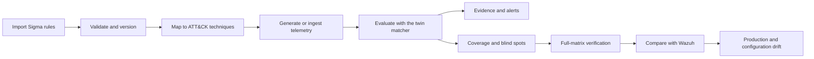
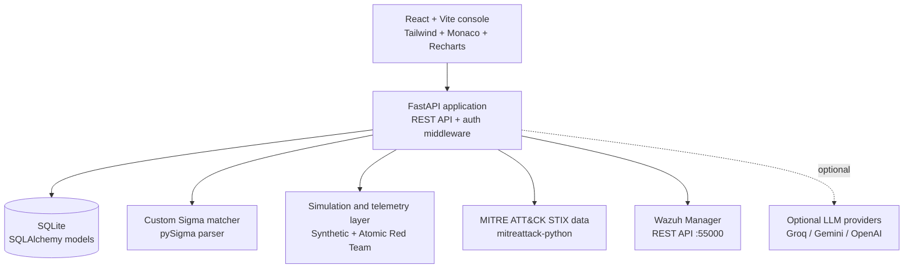
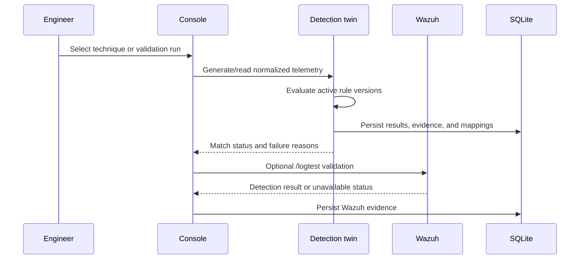

# Detection Digital Twin

> A local detection-engineering console for testing Sigma rules against ATT&CK-mapped telemetry, measuring coverage, and comparing a detection twin with Wazuh.

Detection Digital Twin is a FastAPI and React application for SOC teams and detection engineers. It provides a controlled place to import and version rules, generate or ingest telemetry, exercise detections, inspect evidence, and identify coverage or configuration drift before relying on production behavior.

The project is designed around a useful distinction: **declared coverage is not the same as verified coverage**. A rule can be mapped to a technique while still failing to detect the technique's simulated telemetry.

## What Is Implemented

| Area | Current behavior |
| --- | --- |
| Rule library | Upload, validate, version, update, soft-delete, search, and inspect Sigma rules |
| Detection matching | Custom Sigma condition-tree evaluation with `AND`, `OR`, `NOT`, wildcards, keyword leaves, and match/failure evidence |
| ATT&CK data | Technique metadata loaded from real STIX data through `mitreattack-python` |
| Simulations | Synthetic technique generators plus locally vendored Atomic Red Team command lines |
| Telemetry | Synthetic events, bounded Sysmon and auditd parsing, and telemetry artifact ingestion |
| Coverage | Declared mappings, brute-force verification state, coverage gaps, and ATT&CK Navigator layer export |
| Drift | Twin regression drift, Wazuh production coverage drift, production drift history, and Wazuh rule configuration drift |
| Validation | Wazuh `/logtest` validation runs with persisted evidence and inconclusive handling when Wazuh is unavailable |
| AI assistance | Optional rule search, technique suggestions, and alert explanations; suggestions do not count as verified coverage |
| Access control | HttpOnly JWT session cookies, CSRF protection for browser writes, and an admin role for configuration changes |
| Web console | Overview, environment, rules, testing, attack simulation, alerts, coverage, and drift views |

## Product Flow



## Architecture



### Main components

- **Backend**: FastAPI, Pydantic, SQLAlchemy, and SQLite. The application is assembled in [`backend/app/main.py`](backend/app/main.py).
- **Detection engine**: [`backend/app/detection_engine/matcher.py`](backend/app/detection_engine/matcher.py) evaluates normalized events directly. It is not a wrapper around `wazuh-logtest`.
- **Frontend**: React 19, Vite, Tailwind, Monaco YAML editing, Lucide icons, and Recharts. Navigation is defined in [`frontend/src/App.jsx`](frontend/src/App.jsx).
- **External integrations**: Wazuh is used for production rule inventory, logtest validation, environment synchronization, and drift comparisons. LLM providers are optional.
- **Local corpora**: Atomic Red Team and SigmaHQ content are fetched by scripts under [`backend/scripts`](backend/scripts). These external datasets are not the project's original code.

## Detection and Verification Model



The full-matrix job (`POST /jobs/full-matrix-evaluation`) evaluates active rules against every currently simulatable technique and records the individual rule/technique results. This is the operation that grows verified coverage; importing a mapping alone does not.

The matcher currently supports Sigma rules whose log source product is `windows` or `linux`, and whose category is `process_creation`, `registry_event`, or `network_connection`. Rules outside those categories are retained but are not evaluated by the twin matcher.

## Running Locally

### Prerequisites

- Python. The checked-in test output was produced with Python 3.12.6 on Windows.
- Node.js and npm.
- A Wazuh manager is required only for production synchronization and Wazuh-backed validation. The tested manager line is v4.14.x and its REST API is expected on port 55000.

### Backend

```powershell
cd backend
python -m venv venv
venv\Scripts\activate
pip install -r requirements.txt
python scripts\vendor_atomics.py
python scripts\vendor_sigmahq_rules.py
python -m scripts.create_user admin@example.internal --role admin
uvicorn app.main:app --reload --port 8123
```

The frontend defaults to `http://127.0.0.1:8123`. Set `VITE_API_URL` when running the API on another port.

Create a gitignored `backend/.env` for the services you intend to use:

```dotenv
WAZUH_BASE_URL=https://<wazuh-manager>:55000
WAZUH_USERNAME=wazuh
WAZUH_PASSWORD=<password>
WAZUH_CA_BUNDLE=<optional-path-to-private-ca.pem>
WAZUH_INSECURE_SKIP_TLS_VERIFY=false
JWT_SECRET=<unique-random-value-at-least-32-characters>
```

Authentication is enabled by default. Keep `JWT_SECRET` server-side. For HTTPS deployments, set `AUTH_COOKIE_SECURE=true`. An LLM key (`GROQ_API_KEY`, `GEMINI_API_KEY`, or `OPENAI_API_KEY`) is optional; without one, AI suggestions fall back without blocking the rest of the application.

### Frontend

```powershell
cd frontend
npm install
npm run dev
```

Open the Vite URL shown in the terminal, normally `http://localhost:5173`.

### Tests and checks

```powershell
cd backend
python -m pytest -q
```

The repository's recorded test run contains **53 passing tests**. It also reports one Starlette/httpx deprecation warning. Frontend scripts include `npm run build` and `npm run lint`.

## API Areas

The backend exposes OpenAPI documentation at `/docs` when running. The main route groups are:

- `/auth/*` for login, session inspection, and logout
- `/rules/*` for validation, CRUD, search, testing, and technique suggestions
- `/mitre/*` and `/simulator/*` for ATT&CK metadata and runnable techniques
- `/simulations`, `/evaluate`, `/alerts`, and `/alerts/*/explain`
- `/coverage`, `/coverage/navigator-layer`, `/drift`, and `/drift/production/*`
- `/environments/*`, `/environment/sync`, `/telemetry/ingest`, and `/validation-runs`
- `/jobs/*` for asynchronous full-matrix evaluation
- `/reports/summary` and `/scheduler/status`

## Honest Limitations

- The Atomic-derived event shape is intentionally small: generally `Image`, `CommandLine`, and `ProcessId`, with the image fixed to the executor (`cmd.exe`, `powershell.exe`, `/bin/sh`, or `/bin/bash`). It does not reproduce complete endpoint telemetry.
- Broad rules that match only an executor path can falsely confirm unrelated techniques. Network rules are particularly limited because Atomic-derived events do not yet populate fields such as `DestinationIp`.
- Full-matrix results are useful verification evidence, but they require review for telemetry realism and rule breadth before being treated as independent production-quality proof.
- Sysmon and auditd ingestion is bounded parsing, not a complete event normalization pipeline for every vendor schema.
- SQLite and the in-process background scheduler are suitable for a local or lab deployment, not a demonstrated highly available production architecture.
- Wazuh-dependent behavior needs a reachable, correctly configured manager. Client failures are handled as unavailable or inconclusive results; they do not create production evidence.
- `generate_benign_baseline()` exists in the simulator layer, but there is no completed endpoint or reporting workflow for false-positive-rate estimation.
- AI functionality is optional assistance, not an authority. Suggested mappings are deliberately excluded from verified coverage until confirmed by evaluation.
- There is no claim here of complete ATT&CK technique coverage, complete Sigma language support, or broad multi-tenant SaaS readiness.

## Future Improvements

1. Expand telemetry normalization and simulation fidelity, especially network, registry, and endpoint-specific fields.
2. Add a first-class benign-baseline endpoint and repeatable false-positive metrics.
3. Add stronger correlation across multi-event attack chains instead of evaluating mostly isolated normalized events.
4. Add production deployment guidance with a managed database, external job queue, secret management, observability, and horizontal scaling.
5. Add broader Sigma logsource and modifier support, plus compatibility fixtures for additional Wazuh versions.
6. Add browser-level frontend tests and visual regression checks alongside the existing backend suite.

## Project Status

This is a working research and lab platform with a functional authenticated web console and backend test coverage. It should be evaluated as detection-engineering tooling, not as a drop-in replacement for Wazuh, an endpoint simulator, or a production-grade SIEM.
