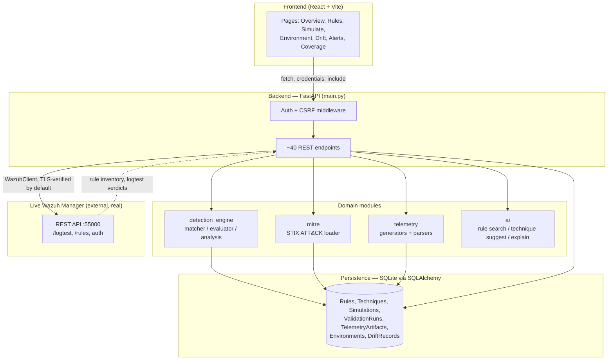
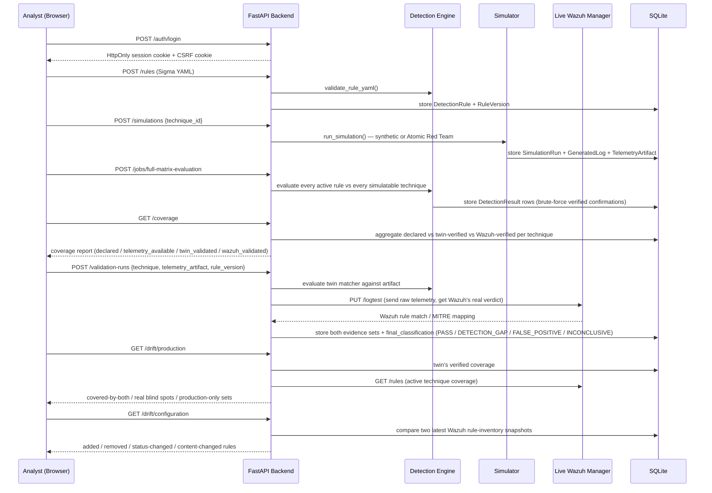
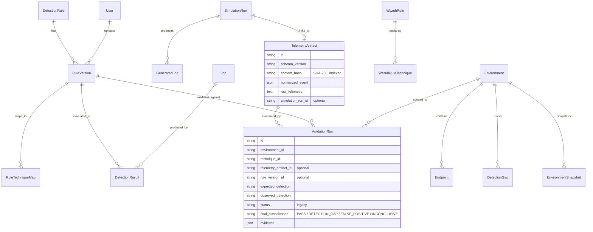

# Detection Digital Twin — Project Scope Document

**Repository:** `AmaimaKhalidSethi/Detection_Digital_Twin`
**Prepared:** August 2026
**Status:** Active — core platform + environment/validation extension shipped, verified against source

---

## 1. Purpose

Detection Digital Twin is a SOC / detection-engineering platform. It lets an analyst import
Sigma detection rules and real MITRE ATT&CK data, safely simulate adversary techniques against
a synthetic "twin" instead of production, measure ATT&CK coverage and blind spots, validate
that coverage against a real, live Wazuh manager, and track configuration and detection drift
over time.

The project's premise: rule coverage claims are worthless until they're *proven* against
telemetry, and production coverage silently drifts as rules and Wazuh configuration change. The
twin is the proving ground; the drift/validation layer is what keeps the twin honest against the
real Wazuh instance.

---

## 2. System Architecture

### 2.1 Stack

| Layer | Technology |
|---|---|
| Backend | FastAPI (Python 3.13) + SQLAlchemy 2.0 + SQLite |
| Detection engine | Hand-written Sigma condition-tree matcher on top of pySigma's parser |
| MITRE ATT&CK data | Real STIX data via `mitreattack-python` (not a hardcoded technique list) |
| Simulation | Synthetic generators + vendored Atomic Red Team atomics |
| Auth | JWT (HS256) in HttpOnly cookie, bcrypt password hashing, double-submit CSRF |
| Production integration | Wazuh manager REST API (`/logtest`, `/rules`), JWT auth with token refresh |
| Frontend | React 19 + Vite + Tailwind + Monaco-based Sigma rule editor |

### 2.2 High-level architecture



### 2.3 Directory layout

```
Detection_Digital_Twin/
├── backend/
│   ├── app/
│   │   ├── main.py               # ~1,700 lines — all HTTP routes, request/response glue
│   │   ├── core/auth.py          # JWT, bcrypt, CSRF, session/user resolution
│   │   ├── detection_engine/     # matcher.py, evaluator.py, analysis.py, rule_manager.py
│   │   ├── mitre/                # attack_data_loader.py + vendored STIX JSON
│   │   ├── telemetry/            # generators/ (synthetic, atomic) + parsers/ (sysmon, auditd)
│   │   ├── wazuh/client.py       # failure-tolerant Wazuh REST client
│   │   ├── ai/                   # rule_search.py, technique_suggester.py, alert_explainer.py
│   │   └── models/db.py          # SQLAlchemy models + guarded in-place migrations
│   ├── scripts/                  # create_user.py, vendor_atomics.py, vendor_sigmahq_rules.py
│   ├── rules/                    # sample Sigma rules
│   └── tests/                    # 14 files, ~78 test functions
├── frontend/
│   └── src/{pages/, lib/api.js, auth/AuthContext.jsx}
└── documentation/
    └── detection-digital-twin-evolution-plan.md
```

---

## 3. Core Workflow

### 3.1 End-to-end analyst workflow



### 3.2 What each phase proves

| Phase | Question it answers |
|---|---|
| Rule import | Is this a syntactically and semantically valid Sigma rule? |
| Simulation | Can we generate realistic telemetry for a given ATT&CK technique, safely, off production? |
| Full-matrix evaluation | Does any active rule *actually* fire against that technique's telemetry — not just claim to? |
| `/coverage` | Per technique: declared vs. brute-force-verified vs. Wazuh-confirmed |
| `/validation-runs` | For one specific (technique, telemetry, rule) triple: does the twin agree with the *real* Wazuh manager? |
| `/drift/production` | Is the twin's verified coverage still consistent with what's actually enabled in production? |
| `/drift/configuration` | Did someone change Wazuh's rule set (added/removed/edited) between two syncs? |

---

## 4. Data Model (key entities)



---

## 5. API Surface (current — ~40 endpoints)

| Group | Endpoints |
|---|---|
| Auth | `POST /auth/login`, `GET /auth/me`, `POST /auth/logout` |
| Environments (admin-write) | `GET/POST /environments`, `POST /environments/{id}/endpoints`, `GET /environments/{id}/endpoints`, `POST /environment/sync`, `GET /environment/snapshots` |
| Telemetry | `POST /telemetry/ingest` |
| Validation | `POST/GET /validation-runs`, `GET /detection-gaps` |
| Rules (admin-write) | `POST /rules/validate`, `POST /rules`, `PUT /rules/{id}`, `GET /rules`, `GET /rules/search`, `GET /rules/{id}`, `DELETE /rules/{id}` |
| Simulation | `POST/GET /simulations`, `GET /simulator/techniques`, `GET /simulator/coverage-gaps` |
| Evaluation | `POST /jobs/full-matrix-evaluation`, `GET /jobs/{id}`, `POST /evaluate`, `POST /rules/{id}/test` |
| AI | `POST /rules/{id}/suggest-techniques` |
| Alerts | `GET /alerts`, `GET /alerts/{id}/explain` |
| Coverage | `GET /coverage`, `GET /coverage/navigator-layer`, `GET /mitre/techniques` |
| Drift | `GET /drift`, `GET /drift/production`, `GET /drift/production/history`, `GET /drift/configuration` (admin-write on sync only) |
| Reporting | `GET /reports/summary` |
| Ops | `GET /health` |

Authorization: every route except `/health`, `/auth/login`, and OpenAPI docs requires a valid
session. Within that, `require_admin` additionally gates configuration-changing routes
(environment/endpoint create, environment sync, rule upload/update/delete) — analysts retain
full read access plus validation-run and telemetry-ingest write access.

---

## 6. Security Posture (as implemented)

| Control | Implementation |
|---|---|
| Session auth | JWT, algorithm pinned to HS256, short-lived, HttpOnly cookie — token never touched by JS |
| Password storage | bcrypt, 12 rounds |
| CSRF | Double-submit cookie, `hmac.compare_digest`, skipped only for `Authorization`-header requests |
| CORS | Locked to explicit dev origins, not `*` |
| Authorization | `require_admin` dependency gates configuration-write routes; analysts get read + validation/telemetry write |
| SQL injection | 100% SQLAlchemy ORM; the only raw `text()` calls are parameterless schema-migration `ALTER TABLE` statements |
| TLS to Wazuh | Verified by default; `WAZUH_INSECURE_SKIP_TLS_VERIFY=true` required to disable, off by default |
| Secrets | `.env`-based, gitignored, `.env.example` provided, `JWT_SECRET` enforced ≥32 chars at runtime |

---

## 7. How to Verify This Yourself

1. **Clone and install**
   ```powershell
   git clone https://github.com/AmaimaKhalidSethi/Detection_Digital_Twin
   cd Detection_Digital_Twin/backend
   python -m venv venv && venv\Scripts\activate
   pip install -r requirements.txt
   python scripts\vendor_atomics.py
   python scripts\vendor_sigmahq_rules.py
   ```

2. **Run the test suite** — this is the fastest objective check:
   ```powershell
   python -m pytest -q
   ```
   Expect ~78 passed, 1 skipped (the skipped test is the real-Wazuh contract test — see below),
   0 failed. A failure here means the claims in this document no longer hold; re-verify before
   trusting anything downstream.

3. **Spot-check the security fixes directly in source** rather than trusting a summary:
   - `grep -n "require_admin" backend/app/main.py` — confirms admin gating is a shared
     dependency applied to write routes, not scattered inline checks.
   - `grep -n "WAZUH_INSECURE_SKIP_TLS_VERIFY" backend/app/wazuh/client.py` — confirms TLS
     verification defaults to `true` (variable must be explicitly set to bypass it).
   - `grep -rn "shell=True\|os.system\|eval(\|exec(" backend/app` — should return nothing outside
     the vendored MITRE STIX JSON.

4. **Run the API and exercise the workflow end-to-end**:
   ```powershell
   uvicorn app.main:app --reload
   python -m scripts.create_user admin@example.internal --role admin
   ```
   Then, in the frontend (`npm install && npm run dev`), log in, upload a Sigma rule, run a
   simulation, trigger `/jobs/full-matrix-evaluation`, and check `/coverage` moves from
   `declared` to `twin_validated` for that technique.

5. **Optional — real Wazuh contract test.** With a reachable Wazuh manager and credentials in
   `.env`, set `DDT_RUN_WAZUH_CONTRACT_TEST=true` and re-run pytest. This is the only test that
   talks to a live external system and is intentionally opt-in so CI/local runs don't depend on
   lab availability.

6. **Cross-check the coverage-quality disclosure.** The README documents a real bug the author
   found in their own full-matrix results (194 of 230 confirmations traced to two overly broad
   placeholder rules). Re-running `/jobs/full-matrix-evaluation` and inspecting `DetectionResult`
   rows for rules matching on executor path alone (e.g. `Image|endswith` with no `CommandLine`
   constraint) is the way to check this class of false-positive-confirmation hasn't recurred.

---

## 8. Known Limitations

1. **Atomic Red Team telemetry fidelity.** Atomic-derived events carry only a generic
   process-creation shape (`Image`, `CommandLine`, `ProcessId`) with a fixed `Image` path per
   executor, regardless of actual technique. Rules matching broadly on executor path alone will
   false-positive-confirm against unrelated techniques sharing that executor. Network-based rules
   are especially affected since connection fields (`DestinationIp`, etc.) aren't populated yet.
2. **Matcher scope.** The custom `RuleMatcher` only evaluates
   `logsource.product ∈ {windows, linux}` and `logsource.category ∈ {process_creation,
   registry_event, network_connection}`. Rules outside that scope are accepted but not evaluated.
3. **Single-tenant authorization model.** Roles are binary (`admin` / `analyst`); there's no
   per-environment or per-rule-set scoping — any admin can act on any environment.
4. **`content_hash` is stored but not enforced.** `TelemetryArtifact.content_hash` (SHA-256) is
   indexed and surfaced in API responses, but there's no unique constraint or server-side dedup
   check — identical telemetry can be persisted more than once.
5. **False-positive-rate estimation is unwired.** `generate_benign_baseline()` exists in the
   telemetry generator but has no API endpoint yet — the "estimate detection effectiveness"
   requirement is only partially met.
6. **No raw log ingestion endpoint.** Sysmon/auditd text-block parsers exist
   (`app/telemetry/parsers/`) but aren't yet wired to a dedicated ingestion route beyond the
   bounded `/telemetry/ingest`.
7. **`main.py` is a flat monolith.** All ~40 routes and a fair amount of business logic live in
   one ~1,700-line file rather than per-domain routers. Functionally fine at current scale;
   will get harder to navigate if the API surface keeps growing.
8. **No LICENSE file** in the repository root.
9. **No audit logging.** Authentication and authorization-denial events aren't centrally logged,
   so there's no record of who attempted what against admin-gated routes.

---

## 9. Suggested Further Improvements

**Near-term (small, high-value)**
- Wire `generate_benign_baseline()` to an endpoint so false-positive rate is measurable, not just implemented.
- Add a unique constraint (or an explicit dedup check) on `TelemetryArtifact.content_hash`.
- Add a raw-log ingestion route that uses the existing Sysmon/auditd parsers directly.
- Regenerate and commit `pytest_output.txt` as part of the normal verification step so it never drifts from the actual suite count.
- Add a LICENSE file.

**Medium-term (structural)**
- Split `main.py` into per-domain routers (`routers/rules.py`, `routers/environments.py`, `routers/drift.py`, `routers/validation.py`) — no behavior change, just navigability.
- Extend Atomic Red Team telemetry generation with technique-specific `CommandLine` and network fields so full-matrix evaluation results need less manual spot-checking.
- Wire Wazuh's `PUT /logtest` more broadly (already used per-validation-run) into a bulk/background comparison mode for continuous production drift detection, not just on-demand.
- Add centralized audit logging for auth events and admin-gated actions.

**Longer-term (scope expansion)**
- Multi-tenant / per-environment role scoping, if this is ever used by more than one team.
- Extend the matcher beyond `{windows, linux}` process/registry/network logsources (e.g. cloud, web, DNS categories) as Sigma rule coverage grows.
- Formal false-positive-rate reporting alongside coverage, so `/coverage` reflects both "does this rule fire on the right telemetry" and "does it stay quiet on benign telemetry."

---

## 10. Change Log Summary (this scope covers)

| Date range | Change |
|---|---|
| Baseline | Rule ingestion, simulation, evaluation, coverage, drift-vs-production, Wazuh read integration. 53-pass test baseline. |
| Extension 1 | Environment/Endpoint/DetectionPlatform/EnvironmentSnapshot/ValidationRun/DetectionGap models and routes added additively; existing schema and tests left untouched. |
| Extension 2 (security & validation hardening) | `TelemetryArtifact` provenance (SHA-256 hash, normalized + raw event, simulation link); dual-evidence validation runs with `final_classification`; Wazuh TLS verification on by default; Wazuh rule fingerprints + `/drift/configuration`; extended `/coverage` fields (`declared`, `telemetry_available`, `twin_validated`, `wazuh_validated`); `require_admin` authorization on configuration-write routes; optional real-Wazuh contract test. Suite grew to ~78 passed, 1 skipped. |

All changes to date have been additive — no destructive schema resets, no removal of existing
detection-engine, MITRE-loader, or matcher behavior, and the original 53-test baseline remains
intact within the current ~78-test suite.